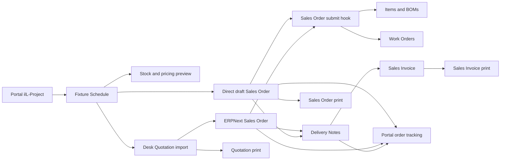

# Dealer Portal Assessment and Implementation Plan

Date: 2026-09-17

## 1. Purpose

This report is a static, implementation-oriented assessment of the current Frappe
dealer/customer portal. It is intended to be handed to another coding agent or
engineer. It covers:

- Current portal routes and user-facing capabilities.
- Authentication, authorization, ownership, and collaborator behavior.
- Confirmed defects, disconnected features, and misleading UI.
- Reliability, maintainability, performance, and test risks.
- High-value quality-of-life improvements.
- A phased implementation plan with acceptance criteria.

The separate Webflow integration is noted where it overlaps, but it should not be
treated as the same application as the Frappe `/portal` experience.

## 2. Investigation Method and Constraints

The review used Repowise `get_overview`, `get_answer`, `search_codebase`,
`get_context`, `get_risk`, `get_why`, `get_health`, and `get_dead_code`, followed
by targeted source inspection of routes, page controllers, API endpoints,
permission hooks, templates, JavaScript, and tests.

Repowise was current at commit `786927c6bd6d` and reported no index drift.

Important runtime constraint: this checkout is the custom Frappe app only. It has
no local bench, site, Frappe, or ERPNext installation. Runtime behavior and browser
screenshots could not be verified here. All P0/P1 findings below are grounded in
source control flow, but they still require execution on a staging bench.

## 3. Executive Assessment

The portal has a broad and valuable feature set, but it behaves like several
independently built tools rather than one dependable product. The main problem is
not missing capability. It is that access rules, state transitions, response
contracts, and interface patterns have diverged across pages and APIs.

Recommended order of work:

1. Correct authorization and data isolation.
2. Add characterization and permission-matrix tests.
3. Consolidate APIs and transaction boundaries.
4. Connect or remove misleading features.
5. Introduce a coherent portal shell and interaction model.
6. Add new quality-of-life features only after the foundation is stable.

Do not begin with a visual redesign. A polished interface on the current permission
model would make unsafe or inconsistent behavior harder to recognize.

### Repowise risk summary

| Surface | Health | Key risk |
| --- | ---: | --- |
| `api/portal.py` | 1.0/10 | 3,612 NLOC, CCN 42, 22.9% duplication, 99.7th percentile change entropy, recent fixes, no paired test file |
| `templates/pages/schedule.py` | 1.65/10 | CCN 81 in `get_context`, 19.7% duplication, recent fixes |
| Schedule DocType controller | 1.85/10 | 1,188 NLOC, CCN 60, god-class behavior, high churn |
| `api/document_requests.py` | 7.06/10 | No paired tests, unscoped list/count APIs, duplicate portal flow |
| Project permission controller | 7.49/10 | `has_permission` CCN 17 and incorrect `ptype` behavior |

The repository average is 7.37/10, but hotspot health is 2.36/10. The portal API is
the repository's worst-scoring file.

## 4. Current Portal Surface

Routes are registered in `illumenate_lighting/hooks.py`.

| Route | Current capability | Primary implementation |
| --- | --- | --- |
| `/portal` | Dashboard, summary counts, recent projects/orders | `templates/pages/portal.py`, `portal.html` |
| `/portal/projects` | Accessible projects, archive/unarchive | `ill_projects.py`, `ill_projects.html` |
| `/portal/projects/new` | Project and customer creation | `project.py`, `project.html`, `api/portal.py` |
| `/portal/projects/<project>` | Project details, schedules, contacts, exports | `project.py`, `project.html` |
| `/portal/projects/<project>/collaborators` | Privacy and existing-user collaborator management | `collaborators.py`, `collaborators.html` |
| `/portal/projects/<project>/schedules/new` | Schedule creation | `schedule.py`, `schedule.html` |
| `/portal/schedules/<schedule>` | Schedule editing, pricing, stock, exports, versions, quote/order actions | `schedule.py`, `schedule.html`, `api/portal.py` |
| `/portal/configure` | Linear, Tape, Neon, and Sheet configurators | `configure.py`, `configure.html`, configurator APIs |
| `/portal/edit_fixture` | Edit configured fixture on a schedule | `edit_fixture.html`, configurator APIs |
| `/portal/orders` | Customer Sales Orders and draft order requests | `orders.py`, `orders.html` |
| `/portal/orders/<order>` | Order items, production, delivery progress | `order_detail.py`, `order_detail.html` |
| `/portal/drawings` | Submit and list document/drawing requests | `drawings.py`, `drawings.html` |
| `/portal/drawings/<request>` | Request details and published files | `drawing_detail.py`, `api/document_requests.py` |
| `/portal/resources` | Public product specification sheets | `resources.py`, `resources.html` |
| `/portal/support` | FAQ, contact details, support Issue creation | `ill_support.py`, `ill_support.html` |
| `/portal/account` | Profile, company, notification and locale settings | `account.py`, `account.html` |
| `/portal/products` | Internal-only product catalog | `products_catalog.py`, product catalog API/JS |

### Separate Webflow surface

`api/webflow_auth.py`, `api/webflow_portal.py`, `api/webflow_schedule.py`, and
`public/js/webflow_portal.js` implement a separate Webflow client. It has better
focused API tests than much of the Frappe portal. Shared policy helpers should be
used by both surfaces, but their session/auth transport and UX should remain
separate.

## 5. Confirmed P0 Security and Permission Defects

### P0.1 Non-dealer company users receive write/delete access

`ill_project.has_permission()` states that regular portal users may view a
non-private company project, but its final branch returns `True` without checking
`ptype`. A company-linked Website User therefore receives `write` and `delete`,
not only `read`.

This flows into:

- Project update, archive, and unarchive.
- Schedule creation within a project.
- Any endpoint that trusts `has_permission(project, "write", user)`.

Schedule `has_permission()` delegates inherited schedules to the project policy,
so the same over-permission reaches schedule edits, status changes, deletion,
quote requests, and configured-fixture replacement.

Required fix: define explicit capabilities, not a generic boolean that ignores
`ptype`. At minimum, company membership alone should grant `read`; owner, Dealer,
internal user, or active `EDIT` collaborator should be required for mutation.

### P0.2 Schedule list visibility disagrees with direct access

For users with no Customer link, schedule query conditions return only schedules
owned by the user. They omit schedules inherited from projects on which the user is
an active collaborator. Direct `has_permission()` delegates to project permission
and may allow the same user to open the schedule by URL.

Impact: invited collaborators can open a known schedule but cannot discover it in
lists or configurator selectors. This is a likely source of "feature not working"
reports.

Required fix: generate list predicates and document decisions from one policy
definition, then add parity tests asserting that discoverability and direct access
agree for every persona.

### P0.3 Document request list and count APIs are globally scoped

`api/document_requests.py::list_requests()` and `get_request_counts()` use
`frappe.get_all`/`frappe.db.count` with status filters only. They do not add
requester, Customer, or permission-query filters.

Impact: any authenticated caller of these whitelisted methods can enumerate
requests and global counts. `list_requests` returns requester identity, project,
request type, reference text, priority, and status.

The current Frappe drawings page does not call these methods, which reduces current
UI exposure but does not make the whitelisted API safe.

Required fix: use a shared scoped query builder or `frappe.get_list`, and test
cross-customer isolation for both result rows and counts.

### P0.4 Drawing request creation accepts an arbitrary project

The actual drawings form calls `api.portal.create_drawing_request()`, not the richer
`api.document_requests.create_request()`. The legacy endpoint accepts a project
name from the browser, does not verify project read/write access, inserts with
`ignore_permissions=True`, and may create a missing Request Type master with
`ignore_permissions=True`.

The richer create endpoint also accepts arbitrary project/item links without
explicit access validation.

Required fix: replace both paths with one request service that:

- Requires an authenticated non-Guest user.
- Validates the request type against active portal-visible types.
- Validates project access with the project policy.
- Validates referenced schedule/item/configured product as applicable.
- Never creates request-type masters from portal input.
- Owns the transaction and rolls back all writes on failure.

### P0.5 Configured records can be attached by identifier without provenance

Read endpoints use `_can_access_configured_record()` to prevent guessed configured
fixture IDs from disclosing data. However, `save_configured_fixture_to_schedule()`
and `update_configured_fixture_on_schedule()` only verify that the configured
record exists. A schedule writer can attach another user's configured record by
name.

Required fix: require record ownership, current schedule provenance, or an
unforgeable validation handoff tied to the session. Apply the same rule to
configured fixtures, Tape/Neon, LED Sheet, and kits.

### P0.6 Mutation policy is inconsistent across collaborator endpoints

Three conflicting policies currently exist:

- Collaborators page: only project owner or System Manager can manage.
- `update_project_collaborators`: only owner or System Manager.
- `invite_project_collaborator`: any Dealer/internal user with project write access.
- `get_user_role_info`: tells every Dealer they can invite collaborators.

The invite/remove/create-website-user APIs are not connected to the Frappe portal
page; the page only adds existing discoverable users through bulk replacement.

Required fix: choose one product rule and encode it as `can_manage_collaborators`.
Recommended default: owner and internal users may manage; a Dealer company admin
may manage company-owned projects only if a separate admin capability is present.
Do not equate the broad Dealer role with company administration implicitly.

## 6. P1 Reliability and Data-Integrity Findings

### 6.1 One API module owns unrelated domains

`api/portal.py` contains roughly 50 whitelisted endpoints spanning projects,
schedules, catalog data, item variants, configured products, orders, contacts,
customers, support, account settings, collaborators, users, LED Sheet, and dealer
pricing.

This is the main source of high change entropy and duplicated policy. Split by
domain behind stable public methods. Do not perform a mechanical file split before
characterization tests exist.

Suggested services/modules:

- `portal/access.py`: actor context and capability decisions.
- `portal/projects.py`: project/customer/contact commands and queries.
- `portal/schedules.py`: schedule commands, versions, line CRUD.
- `portal/configured_products.py`: provenance-safe configured record handoff.
- `portal/orders.py`: order list/detail and document downloads.
- `portal/requests.py`: document requests and support.
- `portal/preferences.py`: validated settings and notification policy.

Compatibility wrappers may remain in `api/portal.py` during migration.

### 6.2 Explicit commits and rollback ownership are inconsistent

Several endpoints call `frappe.db.commit()` directly; others rely on request
transaction handling. `create_schedule_sales_order()` performs a full rollback
because item/BOM writes happen before Sales Order insertion. Some helper functions
also commit while being called from endpoints.

Required fix: the top-level command owns the transaction. Helpers must not commit.
Use savepoints for multi-document workflows and make commands idempotent where a
retry is plausible.

### 6.3 Status changes can bypass document validation

`update_schedule_status()` duplicates transition rules and uses `schedule.db_set`
instead of saving the document. This risks bypassing controller validation and
side effects. The transition map also contains redundant conditional branches and
the QUOTED-to-READY code comment does not match the documented QUOTED-to-DRAFT
auto-version wording.

Required fix: put the state machine on the schedule domain object/service, call it
from all UI/API paths, and test every role/status pair.

### 6.4 Customer selection silently changes on create

If `create_project()` receives a Customer the caller may not use, it silently
replaces it with the caller's own Customer when one exists. This can create a
project for the wrong company while returning success.

Required fix: reject invalid selection with a clear permission error. Never mutate
an authorization-sensitive user choice silently.

### 6.5 API error contracts vary

Some methods throw `frappe.PermissionError`, some return `{success: false}`, some
return `{error: code}` without `success`, and `document_requests.py` exposes raw
exception strings. Frontends therefore need endpoint-specific handling and may
render a failure as an empty state.

Required contract:

```json
{
  "ok": false,
  "error": {
    "code": "permission_denied",
    "message": "You do not have access to this schedule.",
    "field_errors": {}
  }
}
```

Use HTTP/Frappe permission exceptions for authorization failures consistently and
never expose raw database or traceback text.

### 6.6 Public attachment handling needs a threat model

Request attachments are inserted as public `File` records from a client-supplied
`file_url`. Define file type, size, malware scanning, ownership, retention, and
download authorization. Customer documents should normally be private and served
through an access-checked endpoint.

### 6.7 Dynamic HTML is built from server data without systematic escaping

Schedule variant labels, version notes, export metadata, project export metadata,
and global notifications are assembled with `.html()`/`innerHTML`. Several values
originate in user-editable documents.

Required fix: render with DOM text APIs or a template that escapes by default.
Allow HTML only through an explicit sanitizer and an allowlist.

## 7. Features That Look Complete but Are Not

| Feature | Current state | Recommendation |
| --- | --- | --- |
| Notification bell | Global JS looks for `portalNotifications`, `notificationsList`, and `notificationBadge`; no portal template defines them | Build it in the shared shell or remove the dead code |
| Notification preferences | Persisted but not consulted by order, quote, drawing, shipping, or marketing notifications | Wire preferences into a notification service with channel semantics |
| Language/units/date/timezone | Persisted but portal formatting/configurators do not consume them | Implement end to end or label as future and hide controls |
| Avatar upload | Button shows "coming soon" | Implement secure upload/crop or remove action |
| Two-factor setup | "Coming soon" dialog | Link to supported Frappe security flow or remove |
| Session management | "Coming soon" dialog | Use Frappe session tooling or remove |
| Invoice download | "Coming soon" dialog | Access-checked PDF endpoint or remove |
| Packing slip download | "Coming soon" dialog | Access-checked PDF endpoint or remove |
| Live chat | "Coming soon" dialog | Remove until a staffed channel exists |
| Schedule comparison | Disabled "coming soon" control | Implement field/line diff after version model is stabilized |
| Collaborator invite by email | Backend exists, portal page only selects existing company users | Build a coherent invite flow or remove unused APIs |
| Rich document request types | Rich API exists, drawings UI calls a legacy endpoint | Consolidate on one request workflow |

Also fix completion email links in the Document Request controller. They point to
`/portal/requests/<name>`, but the registered route is
`/portal/drawings/<request>`.

Repowise dead-code analysis flags many framework-loaded/whitelisted symbols as
unused, so it must not be used as a deletion list. It does corroborate that the
rich document request methods have no in-repository callers. Dynamic Frappe routes
and external clients must be checked before removing any public method.

## 8. UX and Product Quality Assessment

### 8.1 Why the portal feels amateur

- The dashboard is a marketing-style grid of large cards rather than a work queue.
- Each page embeds substantial custom CSS and JavaScript, producing inconsistent
  spacing, actions, empty states, and feedback.
- `portal.css` defines overlapping token sets and still switches between a default
  system stack and Manrope/Poppins.
- Templates depend on Bootstrap/jQuery/Frappe globals and Font Awesome 4, with some
  pages loading external assets again.
- Most mutations end in a full page reload, losing tab, scroll, and filter state.
- Schedule and configure templates are several thousand lines and mix rendering,
  data transformation, network calls, validation, and state management.
- Errors often collapse into generic dialogs or empty "not found" states.
- Placeholder actions remain visible instead of setting honest expectations.
- Accessibility is not systematic: icon-only actions, disabled anchors, weak focus
  handling, and dynamically replaced content need keyboard/screen-reader review.

### 8.2 Inconsistent business language

- Dashboard recent orders omit drafts, while `/portal/orders` intentionally calls
  drafts "Order Requests" so successful conversion remains visible.
- Dashboard `ready_orders` counts ERPNext `To Bill`, which is not equivalent to
  "Ready to Ship".
- "Pending", "In Production", "Ready", "Order Request", and ERPNext statuses are
  translated differently on different pages.
- Drawing Requests, Document Requests, resources, deliverables, and support Issues
  overlap without a clear information architecture.

Create a portal vocabulary table and map ERPNext states to customer-facing states
in one service.

### 8.3 Dashboard counts do not match accessible records

Dashboard project/schedule stats are Customer-based; recent projects use permission
queries. External collaborators may therefore see a project in recents but no
matching count. Internal users receive global project counts but recent orders are
empty unless they have a Customer link.

All dashboard cards should derive from the same actor-scoped query services as the
destination pages.

### 8.4 Project page can disclose schedule metadata beyond schedule policy

After checking project read access, `project.py` fetches schedules with
`frappe.get_all`. If a schedule opts out of inherited project privacy, a project
reader can still receive its name, status, version, lock state, and line count.

Use the schedule-scoped query service and test private schedule overrides.

### 8.5 Performance risks

- Resources performs one child-document query per product.
- Variant APIs load each Item document in loops.
- Schedule rendering computes pricing, stock, template labels, configured product
  details, and accessory data in one request. Some paths are batched; others remain
  per-line lookups.
- The schedule page controller has CCN 81, making caching and query optimization
  risky without decomposition and query-count tests.

Add query-count budgets around dashboard, project, schedule, orders, and resources.

## 9. Target Authorization Model

Do not implement this as scattered role checks. Build an actor context and named
capabilities.

Suggested personas:

| Persona | Read company public | Read private | Mutate project/schedule | Pricing | Convert order | Manage collaborators |
| --- | --- | --- | --- | --- | --- | --- |
| Guest | No | No | No | No | No | No |
| Website User, same company | Yes | Owner/invited only | Owner or EDIT invite only | Product decision | QUOTED only if explicitly allowed | No |
| VIEW collaborator | Invited records | Invited records | No | Product decision | No | No |
| EDIT collaborator | Invited records | Invited records | Yes, except owner/admin operations | Product decision | QUOTED only | No |
| Dealer | Company records | Company records | Yes | Dealer tier | READY or QUOTED | Product decision |
| Internal | All | All | Yes | All | READY or QUOTED | Yes |

Named decisions should include:

- `can_read_project(actor, project)`
- `can_edit_project(actor, project)`
- `can_archive_project(actor, project)`
- `can_manage_project_collaborators(actor, project)`
- `can_read_schedule(actor, schedule)`
- `can_edit_schedule(actor, schedule)`
- `can_transition_schedule(actor, schedule, target)`
- `can_view_msrp(actor)` and `can_view_dealer_price(actor, schedule)`
- `can_convert_schedule_to_order(actor, schedule)`
- `can_read_order(actor, order)`
- `can_read_request(actor, request)` and `can_edit_request(actor, request)`

Query conditions should be generated from the same rule inputs, with parity tests
against document decisions.

## 10. Existing Test Coverage

Useful existing coverage:

- Project ownership/privacy and VIEW/EDIT collaborator behavior:
  `doctype/ill_project/test_ill_project.py`.
- Schedule validation, locking, order conversion, LED Sheet conversion, and field
  mapping: `doctype/ill_project_fixture_schedule/test_ill_project_fixture_schedule.py`.
- Dealer order authorization, atomicity, idempotency, configured-record access, and
  Sales Order isolation: `api/test_dealer_order_conversion.py`.
- Portal status transitions: `api/test_portal_status_transitions.py`.
- Webflow project/schedule ownership and pricing: `api/test_webflow_portal.py`.
- Webflow authentication: `api/test_webflow_auth.py`.

Critical gaps:

- No paired test file for the main portal API.
- No tests for document request API isolation or attachment authorization.
- No route/page-controller tests for dashboard, projects, orders, drawings,
  support, account, or resources.
- No browser tests for navigation, forms, permissions, mobile layout, keyboard use,
  or stale/loading/error states.
- No contract tests ensuring page buttons and APIs use the same capability.
- No query-count or performance budgets.
- No tests proving saved preferences affect behavior.

## 11. Phased Implementation Plan

### Phase 0: Baseline and safety net

Deliverables:

1. Create persona fixtures for Guest, same-company Website User, VIEW collaborator,
   EDIT collaborator, Dealer, and internal user across two Customers.
2. Add parameterized access-matrix tests for projects, schedules, configured
   records, Sales Orders, document requests, and files.
3. Test list/direct-access parity for every protected DocType.
4. Add API contract tests for each portal mutation.
5. Capture staging screenshots and workflow recordings for desktop and mobile.
6. Add a staging-only smoke suite for every registered portal route.

Exit criteria: tests reproduce the P0 findings before production code changes.

### Phase 1: Authorization and isolation

Deliverables:

1. Introduce the actor/capability layer.
2. Fix project `ptype` handling.
3. Fix schedule inherited and non-inherited `ptype` handling.
4. Make query conditions match direct decisions.
5. Scope all document request list/count/detail/create/attachment operations.
6. Validate configured-record provenance before schedule attachment.
7. Resolve collaborator-management policy and remove duplicate checks.
8. Make Sales Order, export, pricing, and file access use the actor context.
9. Return not-found-style responses for unauthorized guessed IDs where disclosure
   matters.

Exit criteria: the full persona matrix passes, including two-customer negative
tests and guessed-ID tests.

### Phase 2: Domain consolidation and transactions

Deliverables:

1. Add characterization tests around current `api/portal.py` methods.
2. Extract domain services incrementally, retaining compatibility wrappers.
3. Move schedule transitions into one state machine.
4. Remove helper-level commits; define command-level savepoints/rollback.
5. Normalize success/error contracts.
6. Consolidate duplicate Customer/Contact/company-user queries.
7. Consolidate drawing/document request creation on one API.
8. Add structured audit events for project privacy, collaborator, quote, order,
   and file actions.

Exit criteria: no behavioral regression in existing workflows; no direct commit in
reusable helpers; portal API size and duplication decrease materially.

### Phase 3: Make current features honest and complete

Deliverables:

1. Fix document request email routes.
2. Connect collaborator invitations or remove the unused public APIs.
3. Connect notification preferences to actual notification dispatch.
4. Make locale/unit/date settings effective or hide them.
5. Implement access-checked invoice and packing-slip downloads or remove actions.
6. Implement avatar/security links using supported Frappe flows or remove stubs.
7. Remove live-chat and compare controls until functional.
8. Unify customer-facing statuses and dashboard counts.

Exit criteria: no visible control ends in a "coming soon" dialog; every setting has
an observable effect and a test.

### Phase 4: Portal shell and interaction redesign

Deliverables:

1. Create one shared portal shell with persistent navigation, breadcrumbs, actor
   context, notifications, help, and account access.
2. Replace the dashboard card grid with a role-aware work queue: schedules needing
   configuration, quotes ready, order requests awaiting action, shipments, and
   drawing responses.
3. Define one token system and reusable controls for status, empty/error/loading
   states, tables, filters, dialogs, and confirmation.
4. Move inline page CSS/JS into bounded modules.
5. Preserve local state after mutations instead of reloading the page.
6. Add responsive and WCAG 2.2 AA checks.

Exit criteria: Playwright workflows pass at desktop and mobile widths, keyboard
navigation works, and no layout overlap occurs.

### Phase 5: High-value quality-of-life features

Prioritize by customer value and implementation risk:

| Priority | Feature | Value | Relative effort |
| ---: | --- | --- | --- |
| 1 | Role-aware action queue with deep links | Very high | Medium |
| 2 | Global search across projects, schedules, fixture types, orders, and requests | Very high | Medium |
| 3 | Schedule bulk edit, duplicate, multi-select, undo, and autosaved draft | Very high | High |
| 4 | Schedule version compare with line-level diff and restore-as-new-version | High | Medium |
| 5 | Clone project/schedule and reusable schedule templates | High | Medium |
| 6 | Real collaborator invite flow with expiry, resend, revoke, and audit trail | High | Medium |
| 7 | Unified activity timeline for project, quote, order, shipment, and files | High | High |
| 8 | Saved filters/views and recent/favorite projects | Medium-high | Low |
| 9 | Background export center with progress and durable downloads | Medium-high | Medium |
| 10 | Dealer catalog, favorites, quick-add, and reorder from prior orders | High | High/product decision |

Avoid live chat until there is a staffing and SLA model. A reliable asynchronous
support/request thread is more valuable than an unstaffed chat widget.

## 12. Detailed Acceptance Scenarios

The implementing agent should automate at least these scenarios:

1. Same-company Website User can read a public project but cannot update, archive,
   delete, create a schedule, or mutate a schedule without EDIT/Dealer capability.
2. VIEW collaborator can discover and open the invited private project and its
   inherited schedules, but all mutation controls and APIs deny access.
3. EDIT collaborator can discover and edit invited schedules but cannot change
   project privacy or collaborators and cannot convert READY directly to an order.
4. Dealer can manage company projects and see only their Customer's dealer tier.
5. No persona can list, count, open, attach to, or download another Customer's
   document requests/files.
6. A guessed configured fixture ID cannot be read or attached to a schedule without
   provenance.
7. Project and schedule list results match direct `has_permission` decisions.
8. A successful schedule conversion appears consistently on dashboard, orders
   list, and order detail as an Order Request until submitted.
9. Dashboard labels map correctly to ERPNext statuses; `To Bill` is not labeled
   "Ready to Ship" unless business rules explicitly establish that mapping.
10. Every settings control changes real behavior or is absent.
11. Every visible download produces a real, access-checked file.
12. User-authored names, notes, file metadata, and version notes render as text and
   cannot execute markup/script.
13. Failed multi-document commands leave no partial Item, BOM, Customer, Contact,
   User, schedule, or order artifacts.
14. Desktop and mobile workflows support keyboard navigation and maintain focus
   after dialogs and async actions.

## 13. Validation Commands for a Real Bench

Run focused tests first, then the app suite:

```bash
bench --site <site> run-tests --app illumenate_lighting --module illumenate_lighting.illumenate_lighting.doctype.ill_project.test_ill_project
bench --site <site> run-tests --app illumenate_lighting --module illumenate_lighting.illumenate_lighting.doctype.ill_project_fixture_schedule.test_ill_project_fixture_schedule
bench --site <site> run-tests --app illumenate_lighting --module illumenate_lighting.illumenate_lighting.api.test_dealer_order_conversion
bench --site <site> run-tests --app illumenate_lighting --module illumenate_lighting.illumenate_lighting.api.test_portal_status_transitions
bench --site <site> run-tests --app illumenate_lighting --module illumenate_lighting.illumenate_lighting.api.test_webflow_portal
bench --site <site> run-tests --app illumenate_lighting
```

Repository checks:

```bash
ruff check .
ruff format --check .
```

Add Playwright tests against a seeded staging site for all portal routes and the
persona matrix. Include 390x844, 768x1024, and 1440x900 viewports.

## 14. Product Decisions Required Before Implementation

The code does not reliably answer these questions. Resolve them explicitly and
record the result before Phase 1 or the relevant later phase:

1. Should every Dealer mutate all projects for the linked Customer, or only project
   owners/company admins?
   - Every dealer with edit access that is linked to the customer that is linked to said projects should be able to edit those. We just need to be very selective and make sure that the customers know that the people that they are adding have that ability. 
2. Should ordinary same-company Website Users be read-only unless invited with
   EDIT access? This report recommends yes.
   - Yes
3. May non-dealer EDIT collaborators convert a QUOTED schedule to an order, or only
   Dealers/internal users?
   - Only Dealers/internal users
4. Is a draft Sales Order intentionally the durable "Order Request" object, or
   should the portal use a separate request/approval record?
   - draft Sales Order is the order request object
5. Which personas may see MSRP, dealer tier, stock quantities, and lead-time detail?
   - Dealers, System Admins, guest non-dealer EDIT collaborators will not be able to see any of that just the products specified.
6. Should the product catalog become dealer-facing? It is currently System Manager
   only.
   - Let's have it be dealer-facing but we did not build that one out too much so if we are doing that let's also bolster that product catalog to be better and more robust.
7. Are project collaborators allowed to see Customer-level orders and requests, or
   only project-specific artifacts?
   - only project-specific artifacts
8. Which notification channels are supported: in-app, email, SMS, or none?
   - email
9. What are the retention and privacy requirements for drawings, exports, invoices,
   and attachments?
   - keep these on hand up to 1 year if thats what you're asking

## 15. Handoff Instructions to the Implementing Agent

1. Start with Phase 0 tests. Do not refactor `api/portal.py` first.
2. Reproduce P0.1 through P0.5 with failing tests before changing policy.
3. Ask for answers to the Phase 1 product decisions, especially Dealer company-wide
   mutation and collaborator order conversion.
4. Make the smallest policy correction that causes the matrix tests to pass.
5. Keep Webflow and Frappe transport adapters separate while sharing policy.
6. Preserve current public method names through wrappers until all in-repo and
   external consumers are inventoried.
7. Treat Repowise dead-code findings as leads, not proof, because Frappe loads page
   controllers, DocType classes, hooks, and whitelisted methods dynamically.
8. Validate on a real bench and staging site before declaring any portal workflow
   complete.

Definition of done: a feature is complete only when its authorization decision,
data query, mutation transaction, UI state, failure state, and automated tests all
agree for every supported persona.

## 16. ERP Integration Assessment

This section extends the portal assessment into ERPNext. It covers the lifecycle
from a portal fixture schedule through pricing, stock, Quotation/Sales Order,
manufacturing, delivery, invoicing, and print output.

### 16.1 Executive ERP assessment

The schedule-to-transaction converter is substantially stronger than the rest of
the ERP integration. A recent consolidation created one converter for Quotation
and Sales Order rows, added missing product branches, made direct conversion
atomic/idempotent, and standardized Section / Room and Fixture Type fields.

The remaining weaknesses occur before and after that converter:

- Portal stock is on-hand inventory, not available-to-promise stock.
- Linear-fixture stock ignores schedule quantity and aggregate schedule demand.
- Tape/Neon and LED Sheet schedule lines do not receive stock results.
- Dealer pricing shown in the portal uses a simplified Pricing Rule evaluator that
   can disagree with ERPNext's Sales Order pricing engine.
- A draft Sales Order immediately changes the schedule to `ORDERED`.
- Cancelled/deleted order requests do not restore a convertible schedule state.
- Sales Order submission creates Work Orders only for Linear Fixture rows.
- Portal production/shipment progress is inferred from weak proxies and likely
   reads the wrong delivery tracking fields.
- ERPNext project identity and portal `ilL-Project` identity are not reliably
   connected in transaction headers.
- Print formats group Section / Room correctly, but Fixture Type is indirect and
   Purchase Order output drops Fixture Type and additional notes.
- No automated test follows these fields through Delivery Note and Sales Invoice
   or renders the print formats.

Treat these as ERP contract issues, not isolated portal display bugs.

### 16.2 Current end-to-end flow



Primary implementation surfaces:

- Conversion and row mapping:
   `doctype/ill_project_fixture_schedule/ill_project_fixture_schedule.py`.
- Desk Quotation import: `api/quote_from_schedule.py` and
   `public/js/quotation.js`.
- Portal conversion endpoint: `api/portal.py::create_schedule_sales_order`.
- ERP permissions: `dealer_permissions.py` and `hooks.py`.
- Manufacturing handoff: `api/manufacturing_generator.py`.
- Stock and simplified tier pricing: `api/pricing_utils.py`.
- Portal tracking: `templates/pages/orders.py`, `order_detail.py`, and
   `api/portal.py::get_order_details`.
- Custom field migration: `patches/consolidate_section_label_field.py` and
   `fixtures/custom_field.json`.
- Print formats: `print_format/ill_quotation`, `ill_sales_order`,
   `ill_sales_invoice`, and `ill_purchase_order`.

## 17. Schedule to Sales Order Assessment

### 17.1 What is already good

The following design should be preserved:

1. `can_convert_schedule_to_order()` is the shared server-side conversion policy.
2. `append_quote_lines()` is the single schedule-to-transaction row converter.
3. Direct conversion locks the schedule row with `FOR UPDATE`.
4. It returns an existing linked, non-cancelled Sales Order instead of creating a
    duplicate.
5. Item, Item Price, BOM, configured-record, and Sales Order writes are protected
    by a savepoint.
6. A manufactured Linear Fixture without a BOM aborts direct ordering.
7. Skipped/invalid lines are reported to the caller rather than silently dropped.
8. The converter has branches for Linear Fixture, configured/raw Tape/Neon,
    Extrusion Kit, LED Sheet, accessory, and OTHER-manufacturer lines.
9. Dealer ERP permissions are explicitly provisioned and tested with a real Dealer
    user rather than only Administrator.

The August 24 consolidation fixed real regressions: accessory-only schedules,
missing LED Sheet rows, bundle quantity double-counting, READY/QUOTED mismatch,
silent skips, and divergent Quotation/Sales Order behavior.

### 17.2 P0: schedule lifecycle does not match order lifecycle

Direct conversion inserts a draft Sales Order and immediately sets the schedule to
`ORDERED`. The portal calls that draft document an "Order Request". These are
different business states.

The controller says a cancelled Sales Order does not count as linked so the
schedule may be reconverted. In practice, the schedule remains `ORDERED`, and
`can_convert_schedule_to_order()` only accepts READY/QUOTED. Portal status APIs
cannot move an ORDERED schedule back. Deleting a draft request has the same risk.

Required decision and fix:

- Recommended: add `ORDER_REQUESTED` (or retain QUOTED plus a linked draft request)
   and move to `ORDERED` only when the Sales Order is submitted.
- On draft deletion/cancellation, return the schedule to the prior valid state or
   expose a controlled retry action.
- On submitted Sales Order cancellation, define whether the schedule becomes
   QUOTED, CANCELLED, or remains ORDERED with a visible exception state.
- Store the linked Sales Order and transition history explicitly rather than
   inferring the relationship from status alone.

### 17.3 P0: manufacturing handoff excludes configured product types

`on_sales_order_submit()` and `generate_from_sales_order()` only inspect
`ill_configured_fixture`. Rows carrying `ill_configured_tape_neon` or
`ill_configured_led_sheet` are ignored, even though their Items and BOMs are
prepared during conversion. Extrusion-kit/raw-component behavior also relies on
ordinary ERP planning rather than a documented handoff.

Generation errors are logged and submission continues. The portal then has no
customer-facing explanation for a submitted order with no Work Order.

Required fix:

1. Dispatch manufacturing by `ill_product_type`/configured-record lineage.
2. Define which product types require Work Orders, Material Requests, or no custom
    manufacturing action.
3. Make generation idempotent per Sales Order Item, not only configured record.
4. Persist a manufacturing readiness/result status on the Sales Order Item or a
    linked integration-event record.
5. Decide which failures block submission. At minimum, a missing required BOM must
    block or place the order in an explicit exception state.
6. Surface actionable internal and portal statuses instead of relying only on Error
    Log entries.

### 17.4 P1: portal project identity can be lost in ERPNext

A schedule has both:

- Required `ill_project`, linked to the custom `ilL-Project`.
- Optional `project`, linked to ERPNext `Project`.

Direct conversion sets `Sales Order.project = schedule.project`. Portal schedule
creation sets `ill_project` but does not establish the standard ERPNext Project
link. As a result, the Sales Order's standard Project may be blank even though the
portal has a project.

Quotation import does not set `Quotation.ill_fixture_schedule`, despite that field
existing. It only adds rows and returns the schedule name in the API response.
Therefore the Quotation-to-Sales-Order path may also lose header-level schedule
traceability.

Required fix:

- Decide whether every `ilL-Project` creates/links an ERPNext `Project`.
- If yes, enforce and backfill that relationship before order conversion.
- If no, add `ill_project` to the relevant ERP documents and print from that field.
- Set `ill_fixture_schedule` whenever a schedule is imported into a Quotation or
   Sales Order.
- Reject or explicitly handle importing multiple schedules into one transaction.
- Display portal project and schedule identifiers on internal ERP forms and
   customer-facing documents where appropriate.

### 17.5 P1: portal dealer price can differ from Sales Order rate

The portal helper manually selects the highest-priority active selling Pricing Rule
for a Customer Group and applies percentage/rate/amount. It does not reproduce the
full ERPNext pricing engine, including date validity, company, currency, price
list, item/item-group conditions, quantity thresholds, mixed conditions, or other
applicability rules.

The Sales Order is priced by ERPNext when the Item rows are saved. Therefore the
portal's displayed `tier_unit` is not guaranteed to equal `Sales Order Item.rate`.

Required fix: use ERPNext's pricing API with the same Customer, company, currency,
price list, item, UOM, quantity, transaction date, and warehouse context that the
Sales Order will use. Add an invariant test:

`portal preview line rate == newly created Sales Order Item.rate`.

If the portal value is an estimate, label it explicitly and show the final order
total before confirmation.

### 17.6 P1: conversion defaults and exception behavior

- Delivery date is hardcoded to today plus 30 calendar days. It ignores product
   lead times, stock, holidays, promised date, project schedule, and shipping.
- OTHER-manufacturer lines are skipped because they have no Item. This is reported,
   but users can still believe the whole schedule was ordered.
- The direct order path requires a BOM for Linear Fixtures, while the Quotation
   path permits missing BOMs. This is reasonable, but quotation-to-order conversion
   must revalidate manufacturing readiness.
- Direct conversion writes Items/Prices/BOMs. That makes the portal action a
   manufacturing-master mutation, not merely an order request. Audit and permission
   expectations should reflect that.

Recommended confirmation screen before conversion:

- Included and skipped schedule lines.
- Final ERPNext-calculated unit prices and total.
- Requested/promised dates.
- Stock/lead-time classification.
- End-client and ordering Customer.
- Product rows that will create manufacturing artifacts.

## 18. Stock Availability Assessment

### 18.1 Current behavior

Linear-fixture and accessory stock is derived from `tabBin.actual_qty` summed over
all warehouses. Product Bundles are expanded one level. Fixture BOM demand is
reconstructed with manufacturing-generator quantity helpers. Dealers/internal
users see quantities; other users see booleans.

Extrusion Kit stock is calculated separately and correctly scales per-kit component
demand by schedule line quantity.

### 18.2 P0: "All In Stock" ignores ordered quantity and aggregate demand

`batch_stock_for_fixtures()` calculates components for one configured fixture.
The schedule page keys results by configured fixture ID and attaches the same
result to every line. It does not multiply component requirements by `line.qty`.

Example: one fixture requires one profile, stock is one, and schedule quantity is
ten. The portal reports all components in stock.

The same issue occurs when the configured fixture appears on multiple lines. Each
line independently sees the same available inventory. Accessory results are keyed
by Item code, so repeated accessory lines can overwrite one another rather than
reserve/aggregate demand.

Required fix: stock input must be the full schedule demand, with a stable line key
and quantity. Aggregate shared component demand before comparing it to supply, then
return both line allocation and schedule-level shortages.

### 18.3 P0: current value is on-hand, not available to promise

The query sums `actual_qty` across all `Bin` rows. It does not account for:

- Reserved quantities and existing Sales Orders.
- Reservations for production/subcontracting where supported.
- Warehouse/company eligibility or excluded/consignment warehouses.
- Safety stock and reorder policy.
- Transfer lead time between warehouses.
- UOM conversion and the Item's actual stock UOM.
- Required-by date or future receipts.

Do not label this value "In Stock" for ordering decisions. Until ERPNext ATP logic
is implemented, label it "On hand now (not reserved)" and include an as-of time.

Recommended model:

- `on_hand`: physical `actual_qty` in eligible warehouses.
- `available_now`: ERPNext-supported available quantity after reservations.
- `projected_by_date`: supply/demand projection for the requested date.
- `shortage`: required minus available.
- `availability`: `available`, `partial`, `procure`, `make`, or `unknown`.
- `as_of`, `warehouse_scope`, and explanatory warnings.

Prefer ERPNext stock/projected-quantity services over reproducing stock ledger
semantics in custom SQL.

### 18.4 P1: product and component coverage is incomplete

- Leader cables are explicitly disabled with a TODO in both single and batch
   Linear Fixture stock calculations.
- Configured Tape/Neon schedule lines do not receive stock availability in the
   schedule page.
- LED Sheet schedule lines do not receive stock availability.
- Batch Linear Fixture stock includes drivers even when `include_power_supply` is
   false, while the single-fixture path excludes them. The two APIs can disagree.
- Product Bundle expansion is one level; nested bundles are not modeled.
- Tape requirements are labeled and compared in feet without validating the Item's
   stock UOM/conversion factor.
- Missing component definitions produce an empty/false result rather than an
   explicit "configuration incomplete" reason.

Build one BOM-demand service shared by stock display, Sales Order readiness, and
manufacturing. It should consume the actual resolved BOM whenever available and
fall back to configuration math only before a BOM exists.

### 18.5 P1: public stock endpoint is too broad

`get_bom_stock_for_items_api` is guest-accessible, accepts arbitrary Item codes,
and has no input-count limit. Although Guests do not receive raw quantities, they
can probe boolean availability and force bundle/Bin queries.

Require authentication or a tightly constrained catalog scope, cap item count,
validate shape/quantity, rate-limit requests, and cache short-lived results.

### 18.6 Existing stock tests and gaps

Existing tests cover basic Product Bundle arithmetic, fractional stock, bundle
expansion for ad-hoc items, and Extrusion Kit line-quantity scaling.

Add tests for:

1. Linear Fixture `line.qty > 1`.
2. Same component shared by multiple schedule lines/configured products.
3. Duplicate accessory Items on multiple lines.
4. Reservations and eligible warehouse scope.
5. Stock UOM conversion for tape/profile/lens.
6. `include_power_supply` parity between single and batch paths.
7. Leader, Tape/Neon, LED Sheet, kit, accessory, and Product Bundle coverage.
8. Nested bundles or an explicit rejection.
9. Missing BOM/configuration returning `unknown`, not misleading false certainty.
10. Guest/authenticated visibility and input limits.
11. Query-count budget for a 100-line schedule.

## 19. Sales Order Follow-up and ERP Tracking Assessment

### 19.1 Current portal data sources

| Portal concept | ERP source today |
| --- | --- |
| Order/request list | `Sales Order` filtered by linked Customer and `docstatus < 2` |
| "Order Request" | Draft Sales Order (`docstatus == 0`) |
| Production started | Any submitted `Work Order` with matching `sales_order` |
| Production complete | Currently inferred from `Sales Order.per_delivered > 0` |
| Shipment progress | `Sales Order.per_delivered` |
| Shipment records | Submitted `Delivery Note Item.against_sales_order` parents |
| Tracking number | `Delivery Note.tracking_no` via dynamic `get()` |
| Transporter | `Delivery Note.transporter_name` via dynamic `get()` |
| Billing progress | `Sales Order.per_billed` returned but minimally surfaced |

Customer isolation exists at the Sales Order level, and cancelled orders are
hidden. The list batches the "production started" query, which is a good pattern.

### 19.2 P0: production status is materially inaccurate

`production_complete` is true when any quantity has been delivered. Delivery is
not production completion, and a partial delivery does not mean all production is
complete.

The progress percentages are hardcoded milestones (0/25/50/70/85/100), not derived
from Work Order quantities or statuses. A single submitted Work Order marks the
whole Sales Order as production started. Tape/Neon and LED Sheet orders may never
get Work Orders from the custom submit hook, so otherwise valid orders can remain
stuck.

Required read model per Sales Order Item:

- Ordered quantity.
- Manufactured/planned quantity and Work Order status.
- Packed/delivered quantity.
- Invoiced quantity.
- Exception/hold reason safe for portal display.
- Expected completion/ship date from an authoritative ERP field.

Aggregate those rows into truthful customer-facing states such as Received,
Approved, In Planning, In Production, Partially Shipped, Shipped, Completed, On
Hold, or Action Required.

### 19.3 P1: delivery tracking fields are unverified and likely wrong

The app defines neither `tracking_no` nor `transporter_name`, and no tests seed or
assert them. ERPNext commonly stores logistics data under Delivery Note/Shipment
fields such as transporter, LR/AWB number, vehicle, or linked Shipment records,
depending on version and workflow.

On the target staging site, inspect `frappe.get_meta("Delivery Note")` and the
Shipment schema. Choose the actual fields used operationally, then centralize their
mapping. Do not rely on `doc.get()` silently returning empty values.

The current tracking link is also `href="#"`; it does not link to a carrier.
Introduce a carrier/tracking adapter with an allowlisted URL template, or display
the identifier as plain text.

### 19.4 P1: order follow-up is incomplete

- No Sales Invoice list/detail/download is implemented despite `per_billed`.
- Invoice and packing-slip actions are visible "coming soon" stubs.
- Delivery records omit delivered items/quantities and do not explain partial
   shipments.
- Cancelled orders disappear rather than showing an audit-friendly cancelled state.
- Internal users without a linked Customer see no portal orders.
- Customer identity resolution differs between pricing and order views: pricing
   first checks ERPNext `Portal User`, while order views use the first matching
   Contact/Dynamic Link. A multiply linked user can see one Customer's pricing and
   another Customer's orders.

Required fix: one actor-to-Customer resolver with explicit handling for zero, one,
or multiple Customer memberships. A multi-company user should choose an active
account; that account must scope pricing, projects, orders, files, and support.

### 19.5 Recommended ERP order API

Replace page-specific direct queries with an access-checked read service returning:

```json
{
   "order": {
      "name": "SAL-ORD-...",
      "portal_status": "partially_shipped",
      "erp_status": "To Deliver and Bill",
      "ordered_on": "...",
      "requested_delivery_date": "...",
      "promised_ship_date": "...",
      "currency": "USD",
      "total": 0,
      "project": {},
      "schedule": {}
   },
   "lines": [],
   "production": [],
   "shipments": [],
   "invoices": [],
   "timeline": [],
   "actions": []
}
```

Return raw ERP status for support/debugging, but derive portal labels in one tested
mapping service.

## 20. ERP Field Lineage and Print Format Audit

### 20.1 Canonical schedule-to-transaction mapping

| Meaning | Schedule source | Transaction destination | Current print behavior |
| --- | --- | --- | --- |
| Section / Room | `line.location` | `ill_section_label` | Groups Quotation, SO, SI, and PO rows |
| Fixture Type | `line.line_id` | `ill_fixture_type` | Not printed directly; duplicated into `additional_notes` |
| Additional Info | `line.notes` plus Fixture Type prefix | Standard `additional_notes` | Printed below item on Quotation, SO, and SI |
| Schedule line trace | Child row `line.name` | `ill_schedule_line_id` | Stored only on Quotation/SO Item; not printed |
| Fixture schedule trace | `schedule.name` | Header `ill_fixture_schedule` | Set for direct SO; not set by Quotation import; not printed |
| Portal project | `schedule.ill_project` | No consistent transaction field | Print reads standard ERPNext `doc.project` instead |
| Build/configuration detail | Configured record | Item description and `ill_*` lineage fields | Print prefers `item_name` over description, so build detail may be hidden |

Every branch in `append_quote_lines()` calls `_stamp_group_fields()` for its added
rows, including exploded Tape/Neon and kit rows. Existing tests cover field stamping
for Linear Fixture, configured/raw Tape/Neon, kit, accessory, LED Sheet, and mixed
rows.

### 20.2 Section / Room status

The canonical field is `ill_section_label`. The consolidation patch:

- Creates it on Quotation Item, Sales Order Item, Delivery Note Item, Sales Invoice
   Item, and Purchase Order Item.
- Copies values from stray `custom_ill_section_label` columns.
- Removes stray Custom Field records.
- Adds identical Fixture Type fields through Sales Invoice Item.

Quotation, Sales Order, and Sales Invoice formats still retain a
`custom_ill_section_label` fallback. This is harmless for legacy documents but
should not be treated as a second writable field.

Semantic issue: the portal labels the source field "Location", while ERP output
labels it "Section / Room" and uses it for grouping. Decide whether Location means
room/section or a more specific placement. Recommended model:

- `section_room`: grouping key printed as Section / Room.
- `location_detail`: optional placement such as north wall, cove, desk, or bay.

If only one field is retained, label it consistently as Section / Room in the
portal and schedule DocType.

### 20.3 Fixture Type status

`ill_fixture_type` exists and maps by identical fieldname through Quotation Item,
Sales Order Item, Delivery Note Item, and Sales Invoice Item. However:

- Quotation/SO/SI print formats never read it.
- They depend on the redundant `Fixture Type: <line_id>` text in
   `additional_notes`.
- Purchase Order Item does not have `ill_fixture_type`.
- Purchase Order print cannot display it.

Recommendation: print Fixture Type from `ill_fixture_type` in a dedicated compact
column or item metadata row. Keep `additional_notes` for actual user notes only
after a data migration/backward-compatibility period. This prevents the same fact
from being stored both structurally and as formatted text.

### 20.4 Additional Info status

Schedule `line.notes` is appended to standard `additional_notes`, and Quotation,
Sales Order, and Sales Invoice formats render that field below the item.

Gaps:

- Quotation-to-Sales-Order tests do not assert `additional_notes` survives.
- No test maps through Delivery Note or Sales Invoice.
- Purchase Order print does not render `additional_notes`.
- "Additional Info" is not formally defined: line notes, Item description,
   configured build description, and internal remarks are separate concepts.
- Item print cells use `item.item_name or item.description`, so the description is
   hidden whenever ERPNext populates Item Name. Configuration/build detail stored in
   description may therefore never print.

Recommended explicit fields/presentation:

- Fixture Type: structural `ill_fixture_type`.
- Section / Room: structural `ill_section_label`.
- Customer line note: standard `additional_notes` or a named custom field.
- Product name/code: standard Item fields.
- Configuration summary: generated from immutable `ill_*` lineage/configuration
   snapshot, shown only where useful.
- Internal manufacturing note: never mixed into customer-facing notes.

### 20.5 Purchase Order mismatch

Purchase Order has only `ill_section_label`. Its print format groups sections but
does not display Fixture Type or additional notes. No app code was found that maps
Sales Order schedule metadata into Purchase Order Items. Standard ERP procurement
often flows through Material Request/Supplier Quotation, and those item doctypes do
not have the custom fields in the consolidation patch.

Therefore the Purchase Order grouping field may be manually populated or lost in
normal procurement flows. Before adding more fields, document the actual ERP
procurement path and extend identical fieldnames across every mapped intermediate
item DocType. Add chain tests for that exact path.

### 20.6 Schedule export is a separate rendering path

The Fixture Schedule PDF/CSV export reads `line_id`, `location`, and `notes`
directly from schedule lines. It does not validate the transaction custom-field
pipeline. A correct schedule PDF can coexist with an incorrect Sales Order or
Invoice print.

Test both outputs from one seeded schedule and compare their semantic values.

## 21. Missing ERP Contract Tests

Existing tests prove schedule branches and Quotation-to-Sales-Order preservation of
`ill_section_label` and `ill_fixture_type`. They do not prove the complete ERP path.

Add these suites before refactoring:

### 21.1 Transaction mapping tests

1. Portal schedule -> direct draft SO.
2. Schedule -> Quotation -> SO.
3. SO -> Delivery Note.
4. SO/Delivery Note -> Sales Invoice.
5. Actual procurement path -> Purchase Order.
6. Assert Section / Room, Fixture Type, additional note, schedule header, schedule
    line ID, project identity, configured-product lineage, quantities, rates, and
    BOM on every applicable document.
7. Cover Linear, Tape, Neon, Sheet, kit, accessory, mixed, and skipped OTHER rows.

### 21.2 Lifecycle and manufacturing tests

1. Draft order request creation does not falsely imply submitted ORDERED state.
2. Submit transitions schedule exactly once.
3. Draft deletion, rejection, and submitted cancellation transition predictably.
4. Retry is idempotent under concurrency.
5. Work Order generation covers every manufacturing product type.
6. Missing/invalid BOM behavior matches the chosen block/exception policy.
7. Work Order quantities match Sales Order Item quantities.

### 21.3 Print-render contract tests

Render each custom Print Format with a seeded document and assert escaped visible
text for:

- Section / Room.
- Fixture Type.
- Additional customer note.
- Product name/code and configuration summary.
- Project and fixture schedule references.
- Quantities, rates, subtotals, totals, dates, and currency.

Include no-section, one-section, multiple-section, exploded-component, long-note,
page-break, and special-character cases. Generate PDFs in staging and perform a
visual regression check, because Jinja HTML success does not prove wkhtmltopdf
layout correctness.

### 21.4 Order tracking tests

Seed draft/submitted/on-hold/partially manufactured/fully manufactured/partially
delivered/fully delivered/partially billed/fully billed/cancelled cases. Assert the
portal label, progress, dates, shipments, tracking data, invoices, and allowed
actions for each case.

## 22. ERP Hardening Implementation Order

### ERP Phase A: contract baseline

1. Add the mapping, lifecycle, stock, tracking, and print-render tests above.
2. On staging, export DocType metadata for every source/intermediate/destination
    document and confirm actual fieldnames.
3. Seed one golden schedule containing every product branch and distinctive values
    for Fixture Type, Section / Room, and notes.
4. Carry it manually through Quotation, SO, Work Order, Delivery Note, Invoice, and
    the real Purchase Order path; archive resulting JSON and PDFs as test fixtures.

### ERP Phase B: conversion and manufacturing

1. Separate Order Requested from ORDERED lifecycle.
2. Repair cancellation/retry transitions.
3. Establish explicit portal-project/ERP-project/schedule header links.
4. Set header trace fields on Quotation imports.
5. Dispatch manufacturing for all configured product types.
6. Persist integration readiness/errors and make them visible.
7. Replace hardcoded delivery date with promised-date policy.
8. Ensure portal preview rates use the ERPNext pricing engine.

### ERP Phase C: stock

1. Define eligible warehouses and ATP semantics with operations.
2. Build one schedule-demand/BOM-demand service.
3. Aggregate demand and scale every line by quantity.
4. Cover all product types and omitted components.
5. Use ERPNext stock/reservation APIs and UOM conversions.
6. Add as-of time, scope, unknown/partial states, caching, and query budgets.
7. Restrict the guest stock endpoint.

### ERP Phase D: order follow-up

1. Build the item-level ERP order read model.
2. Replace hardcoded progress with Work Order/Delivery/Invoice quantities.
3. Resolve actual Shipment/Delivery Note tracking fields on the deployed version.
4. Add partial-shipment details and promised dates.
5. Add access-checked invoice, packing-slip, and shipment document downloads.
6. Add one active-company context for multi-company users.

### ERP Phase E: field and print consistency

1. Define Section / Room, location detail, Fixture Type, customer note,
    configuration summary, and internal note semantics.
2. Extend fields through the actual transaction/procurement chains.
3. Render structural Fixture Type directly rather than parsing note text.
4. Add missing Purchase Order fields/output if the business process requires them.
5. Show portal project/schedule references from authoritative links.
6. Add automated Jinja and PDF visual-regression tests.

## 23. ERP Product Decisions Required

Resolve these before ERP Phase B/C:

1. When is a schedule truly ORDERED: draft Sales Order creation, internal approval,
    or Sales Order submission?
    - Sales Order submission, this is how our team will "approve" the customers' SO request. The draft sales order means its still pending approval.
2. What state follows order-request rejection, deletion, or Sales Order cancellation?
   - A new state called "Issue" and it should have some copy saying to reach out to sales@illumenate.lighting for more information if they have not been in contact with you already.
3. Should configured Tape/Neon, LED Sheet, kits, and accessories create Work Orders,
    Material Requests, Product Bundle packing rows, or standard ERP planning only?
    - standard ERP planning only
4. Which warehouses count for portal availability, and is inter-warehouse stock
    transferable for a promise?
    - ilL-Stores
    - No
5. Is portal availability on-hand, available now, or projected by promised date?
    - availabile now
6. Can portal viewing reserve inventory? If so, at quote, order request, approval,
    or submission?
    - No only when they convert to sales order and it gets submitted
7. Is `line.location` genuinely Section / Room, or are those separate fields?
    - That is genuinely Section / Room, also for `line.line_id` | `ill_fixture_type`, don't copy this information in additional_notes, instead any notes I add in the portal should be in additional_notes and display underneath but for the fixture_type I want that to be displayed above the line item
8. Should Fixture Type be a dedicated printed column, metadata under the product,
    or both?
    - Fixture type should be a dedicated printed row like a note above the line item, this information should not be copied to additional_notes, and any notes I add in the portal should be in additional_notes and that should display underneath the line item
9. What exactly is customer-facing "Additional Info" versus configuration summary
    and internal manufacturing notes?
    - anything the customer adds in the notes field while configuring the fixture, if we don't have a field like that then lets add one and link those. Configuration summary should be included in the description.
10. Should Purchase Orders carry customer Section / Room and Fixture Type, and what
      is the real ERP document chain used to create them?
      - We don't need to do purchase orders, the portal fixture schedule is like their quote, and then when they convert over to Sales Order that "Ready" field change and the order is the "Purchase Order" there should be a field underneath maybe for PO Number so that the Dealer can add that in before submitting sales order for tracking.
11. Which ERP field is the authoritative promised ship/delivery date?
      - Delivery Date on Sales Order
12. Which Delivery Note/Shipment fields are operationally maintained for carrier
      and tracking number?
      - Delivery Note - transporter_name, vehicle_no (vehicle_no is tracking number)

ERP definition of done: the same golden schedule produces semantically identical
Fixture Type, Section / Room, notes, quantities, pricing, product lineage, and
project/schedule references throughout every applicable ERP document and print;
stock is labeled according to a documented supply calculation; and portal order
status is derived from authoritative ERP quantities and events.