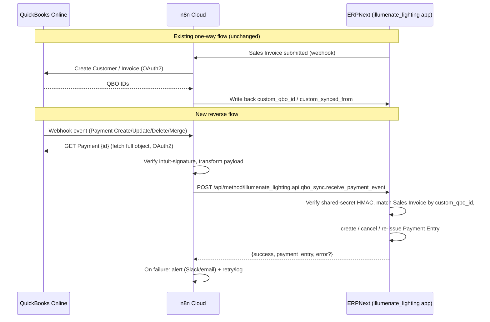

# QuickBooks Online ⇄ ERPNext: Payment Reverse-Sync Implementation Plan

**Status:** ERPNext side implemented (2026-09-17) — see §6 for what remains (n8n + Intuit configuration).
**Hosting note:** ERPNext runs on Frappe Cloud with no SSH/bench access. Everything below deploys via git push → Frappe Cloud deploy (runs `bench migrate`, which syncs the new doctypes and runs the patch). The webhook secret is entered in the **ilL-QBO-Settings** Single doctype (Password field) instead of `bench set-config`; a `qbo_webhook_secret` site-config key is still honored if set through the Frappe Cloud dashboard.
**Scope:** Add QBO Payment → ERPNext Payment Entry sync (with void/edit handling) on top of the existing one-way ERPNext → QBO push (Customers + Sales Invoices, triggered on ERPNext submit via n8n).
**Out of scope (explicitly deferred):** ERPNext-originated Payment Entry → QBO push, partial/multi-invoice payment allocation, multi-currency, multi-company.

---

## 0. Current state (verified from the codebase)

- One-way sync already exists: ERPNext → n8n (on Sales Invoice submit webhook) → QBO, using n8n's built-in QuickBooks OAuth2 credential.
- ERPNext already has QBO linkage fields (added in [`illumenate_lighting/patches/add_qbo_sync_fields.py`](../illumenate_lighting/patches/add_qbo_sync_fields.py) and mirrored in [`custom_field.json`](../illumenate_lighting/illumenate_lighting/fixtures/custom_field.json)):
  - `Customer.custom_qbo_id`, `Customer.custom_synced_from`
  - `Supplier.custom_qbo_id`, `Supplier.custom_synced_from`
  - `Sales Invoice.custom_qbo_id`, `Sales Invoice.custom_synced_from`
  - `Purchase Invoice.custom_qbo_id`, `Purchase Invoice.custom_synced_from`
  - `Payment Entry.custom_qbo_id`, `Payment Entry.custom_synced_from`
- There is **no** existing QBO webhook receiver, no `qbo_sync.py` API module, and no n8n workflow JSON checked into `n8n_workflows/` for QBO (unlike the Webflow workflows, which are exported there). The QBO n8n workflow lives only in the n8n Cloud instance.
- `Payment Entry.custom_qbo_id` already exists — reuse it to store the **QBO Payment object Id**, so no new custom field is strictly required for identity. A couple of *new* fields are still needed for safe void/edit handling and observability (see §2).
- Confirmed environment: ERPNext/Frappe **v16**, **n8n Cloud**, ERPNext already reachable at a public HTTPS URL. Single Company, single currency, single QBO company file.
- Payments should post to **`1010 - ilLumenate Lighting WA Trust - ilL`**. No partial-payment / multi-invoice allocation needed (1 QBO Payment → 1 Sales Invoice, full amount).
- Invoice matching: **strict** match on `Sales Invoice.custom_qbo_id` only — no DocNumber/customer fallback. If no match, fail loudly (see §4 error handling) rather than guessing.
- Void/refund/edit from QBO must be handled, not just payment creation.

---

## 1. Target architecture



Key design decisions:

1. **Intuit webhooks never call ERPNext directly.** Intuit only fires webhooks to the URL registered in the Intuit Developer dashboard (n8n's webhook URL). n8n fetches the full `Payment` entity from QBO (Intuit webhooks only carry `{realmId, entity id, operation, lastUpdated}` — no payload), then forwards a normalized payload to ERPNext.
2. **ERPNext exposes one whitelisted, guest-accessible endpoint** protected by an HMAC shared secret (same pattern already used for guest-whitelisted endpoints in `webflow_auth.py` / `webflow_integration.py`, but with signature verification added since this endpoint mutates financial records).
3. **Idempotency & auditability live in ERPNext**, not n8n: every inbound event is logged to a new lightweight child doctype/log before acting, so replayed or out-of-order webhooks (Intuit webhooks are "at least once" and can arrive out of order) can't double-create or corrupt Payment Entries.

---

## 2. ERPNext-side changes

### 2.1 New custom fields (patch + fixture, additive only)

Add to the existing `Payment Entry` custom fields (extend `add_qbo_sync_fields.py` pattern with a new patch `add_qbo_payment_sync_fields.py`, or add directly to `custom_field.json` + a new patch):

| DocType | Fieldname | Type | Notes |
|---|---|---|---|
| Payment Entry | `custom_qbo_event_type` | Select (`Create`, `Update`, `Delete`, `Merge`) | Last event type processed, for audit. |
| Payment Entry | `custom_qbo_last_synced` | Datetime | Timestamp of last successful sync from QBO. |
| Payment Entry | `custom_qbo_sync_note` | Small Text | Free-text note (e.g. "Recreated after QBO edit; superseded PE-0001"). |

`Payment Entry.custom_qbo_id` (already exists) stores the QBO `Payment.Id`. **Uniqueness enforcement:** since it's a plain Data field today, add a patch to also create a DB-level check via `frappe.db.exists` in code (Frappe custom fields don't support unique constraints retroactively without care) — simplest: just always query before insert (see §2.3) rather than adding a unique index, to avoid migration risk on existing data.

### 2.2 New doctype: `ilL-QBO-Sync-Log` (simple log/audit doctype)

Purpose: durable, queryable record of every inbound QBO payment event — required for debugging Intuit's at-least-once/out-of-order delivery and for the void/edit flows below. Modeled the same way as other `ilL-*` child/support doctypes already in `illumenate_lighting/illumenate_lighting/doctype/`.

Fields:
- `qbo_payment_id` (Data, indexed) — QBO Payment.Id
- `qbo_event_type` (Select: Create/Update/Delete/Merge)
- `qbo_txn_date`, `qbo_amount` (Currency)
- `sales_invoice` (Link to Sales Invoice, nullable — null if no match found)
- `payment_entry` (Link to Payment Entry, nullable)
- `status` (Select: Received / Matched / Created / Skipped-Duplicate / Failed / Cancelled)
- `raw_payload` (Long Text / JSON) — full normalized payload received from n8n, for replay/debugging
- `error_message` (Small Text, nullable)

This also gives you a Desk list view to eyeball sync health without digging through Error Log.

### 2.3 New API module: `illumenate_lighting/illumenate_lighting/api/qbo_sync.py`

```python
@frappe.whitelist(allow_guest=True)
def receive_payment_event():
    """
    Single entry point called by n8n after fetching a QBO Payment object.

    Expected JSON body:
    {
        "qbo_payment_id": "182",
        "event_type": "Create" | "Update" | "Delete" | "Merge",
        "amount": 1234.56,
        "txn_date": "2026-09-15",
        "qbo_invoice_id": "145",           # QBO Invoice.Id linked via LinkedTxn
        "customer_qbo_id": "62",            # optional, for logging/cross-check only
        "deleted": false                    # true when QBO reports the Payment as voided/deleted
    }

    Auth: verified via HMAC-SHA256 signature in `X-QBO-Signature` header,
    computed over the raw request body using a shared secret stored in
    site_config.json as `qbo_webhook_secret`. Reject with 401 on mismatch.
    """
```

Responsibilities, in order:
1. **Verify signature** (`hmac.compare_digest`) against `frappe.conf.qbo_webhook_secret`. Reject (403) if missing/invalid — do this before touching the DB or logging the payload (avoid logging unauthenticated payloads verbatim; log only a hash/summary on auth failure).
2. **Write an `ilL-QBO-Sync-Log` row first** (status=`Received`), so even if downstream logic throws, there's a durable record — needed because Intuit will retry if it doesn't get a 2xx quickly.
3. **Match invoice**: `frappe.db.get_value("Sales Invoice", {"custom_qbo_id": qbo_invoice_id}, "name")`. If none found → log `status=Failed`, `error_message="No Sales Invoice with custom_qbo_id=..."`, return `{"success": False, "error": "invoice_not_matched"}` (n8n branches to an alert on this).
4. **Idempotency check**: `frappe.db.get_value("Payment Entry", {"custom_qbo_id": qbo_payment_id, "docstatus": ["!=", 2]}, "name")`.
   - **Create event, no existing PE** → create new Payment Entry (see §2.4).
   - **Create event, existing PE with same id+amount** → no-op, log `Skipped-Duplicate` (handles Intuit's at-least-once redelivery).
   - **Update event** → if amount/date unchanged, no-op; if changed, **cancel** existing Payment Entry (`pe.cancel()`) and create a fresh one, chaining `custom_qbo_sync_note` to point at the superseded doc name (Payment Entry doesn't support amend-after-cancel the way Sales Invoice does when it's a submittable child of reconciled GL entries — cancel + recreate is the safe, standard ERPNext pattern here).
   - **Delete/void event** → find existing Payment Entry by `custom_qbo_id`, cancel it (`docstatus=2`) if not already cancelled. Do **not** delete the ERPNext doc — cancellation preserves the audit trail, which is what you want for accounting.
   - **Merge event** (Intuit-specific: happens when a duplicate entity in QBO gets merged into a canonical one) → treat like Update but re-key on the new canonical `Id` supplied by QBO; log clearly since this is rare and worth a human glance.
5. Wrap all mutating logic in `frappe.db.savepoint()` / try-except so a failure midway rolls back cleanly and the sync log still records `Failed` with `error_message`.
6. Return `{"success": True, "payment_entry": pe.name, "action": "created"|"skipped"|"cancelled"}`.

### 2.4 Payment Entry creation helper

```python
def _create_payment_entry(sales_invoice_name, qbo_payment_id, amount, txn_date):
    si = frappe.get_doc("Sales Invoice", sales_invoice_name)
    pe = frappe.new_doc("Payment Entry")
    pe.payment_type = "Receive"
    pe.party_type = "Customer"
    pe.party = si.customer
    pe.company = si.company
    pe.posting_date = txn_date
    pe.paid_to = "1010 - ilLumenate Lighting WA Trust - ilL"
    pe.paid_to_account_currency = frappe.db.get_value("Account", pe.paid_to, "account_currency")
    pe.mode_of_payment = "QuickBooks Online"   # new Mode of Payment, see §3
    pe.paid_amount = amount
    pe.received_amount = amount
    pe.reference_no = qbo_payment_id            # QBO payment id, useful on the PE itself too
    pe.reference_date = txn_date
    pe.append("references", {
        "reference_doctype": "Sales Invoice",
        "reference_name": si.name,
        "allocated_amount": amount,
    })
    pe.custom_qbo_id = qbo_payment_id
    pe.custom_synced_from = "QuickBooks Online"
    pe.custom_qbo_event_type = "Create"
    pe.custom_qbo_last_synced = frappe.utils.now_datetime()
    pe.insert(ignore_permissions=True)
    pe.submit()
    return pe
```

Notes:
- `paid_amount` == `si.outstanding_amount` is **not** assumed — trust the amount QBO reports, but log a warning (not a hard failure) in the sync log if it doesn't match the invoice's outstanding amount, since MVP has no partial-allocation logic and a mismatch likely means manual review is needed.
- Runs as a background-safe whitelisted call; use `ignore_permissions=True` since the Guest-authenticated webhook path has no session user with Payment Entry create rights — protect this exclusively via the HMAC signature check, not Frappe's permission system.

### 2.5 Security note (important)

Because this endpoint is `allow_guest=True` and creates/cancels financial documents, the HMAC signature check is the **only** access control — treat `qbo_webhook_secret` like a production credential:
- Store it in `site_config.json` (`bench set-config qbo_webhook_secret <value>`), never in source.
- Rotate it if it's ever logged or exposed; n8n stores the same value in an n8n credential/env var, not hardcoded in the workflow JSON.
- Reject any request without a valid signature with a generic 401 (don't leak whether the invoice/payment matched).
- Rate-limit / alert on repeated signature failures (could indicate the endpoint URL leaked).

---

## 3. ERPNext configuration (manual setup, not code)

1. Create Mode of Payment **"QuickBooks Online"** (Accounts Settings), with default account mapped to `1010 - ilLumenate Lighting WA Trust - ilL` for the relevant Company, so the helper in §2.4 doesn't need to hardcode the account lookup path beyond `paid_to`.
2. Confirm `1010 - ilLumenate Lighting WA Trust - ilL` is a valid Bank/Cash account with a matching currency to the Company's default currency (single-currency per your answers, so no conversion logic needed).
3. Set `qbo_webhook_secret` in `site_config.json` via `bench --site <site> set-config qbo_webhook_secret <random-64-char-value>` (generate with `openssl rand -hex 32`).
4. Confirm the n8n ERPNext API key/secret user has at minimum: `create`, `submit`, `cancel` on Payment Entry, and `read` on Sales Invoice/Customer/Account — since you said it currently has "max permissions" this is likely already covered, but worth confirming least-privilege isn't required by your security policy.

---

## 4. n8n Cloud workflow design (new workflow, separate from the existing push workflow)

**Trigger:** Webhook node (production URL registered with Intuit as the app's webhook endpoint), method POST.

Steps:
1. **Webhook node** — receives Intuit's notification: `{"eventNotifications":[{"realmId":"...","dataChangeEvent":{"entities":[{"name":"Payment","id":"182","operation":"Create","lastUpdated":"..."}]}}]}`.
2. **Verify `intuit-signature` header** (Code node): Intuit signs the raw body with HMAC-SHA256 using your app's **Webhooks Verifier Token** (from the Intuit Developer dashboard, distinct from the OAuth2 client secret). Reject (respond 401, stop) if it doesn't match — this prevents spoofed events from ever reaching your QBO API credential or ERPNext.
3. **Split out entities** (Split In Batches / loop), filter to `name == "Payment"`.
4. **Fetch full Payment object**: HTTP Request node (or QuickBooks node) `GET /v3/company/{realmId}/payment/{id}` using the existing OAuth2 credential, to get `TotalAmt`, `TxnDate`, `Line[].LinkedTxn` (find the `TxnType: "Invoice"` linked txn to get the QBO Invoice Id).
5. **Detect delete/void**: Intuit reports deletes via `operation: "Delete"` in the same webhook (no separate fetch possible since the entity is gone) — branch here: if `operation == "Delete"`, skip the fetch step and forward `{qbo_payment_id: id, event_type: "Delete"}` directly.
6. **Transform** into the normalized payload from §2.3.
7. **Sign the outbound request**: Code node computes `HMAC-SHA256(body, qbo_webhook_secret)` (same secret as ERPNext's `site_config.json`), sets header `X-QBO-Signature`.
8. **HTTP Request to ERPNext**: `POST https://<your-site>/api/method/illumenate_lighting.api.qbo_sync.receive_payment_event`, headers: `X-QBO-Signature`, `Content-Type: application/json`. (No ERPNext API-key auth needed on this specific call since it's guest+HMAC — keeps it decoupled from user/session permission changes.)
9. **Error branch**: on non-2xx response or `{"success": false}`, send a Slack/email alert with the payload + error, and let n8n's built-in retry/error workflow handle transient failures (QBO/ERPNext downtime).
10. Register the workflow's production webhook URL in the **Intuit Developer Dashboard → Webhooks**, subscribed to the `Payment` entity only (don't over-subscribe to Invoice/Customer here — that's already covered by the existing outbound flow).

---

## 5. Testing plan

1. **Sandbox first**: use an Intuit sandbox company (separate from production QBO) and ERPNext's staging/UAT site if one exists, otherwise a manual test Sales Invoice with a fake `custom_qbo_id`.
2. Unit tests in `illumenate_lighting/illumenate_lighting/api/test_qbo_sync.py` (follow the existing `test_*.py` conventions in the `api/` folder):
   - Create event → matched invoice → Payment Entry created with correct `paid_to`, `paid_amount`, `custom_qbo_id`.
   - Create event → no matching invoice → returns `invoice_not_matched`, log row created with `status=Failed`.
   - Duplicate create event (same `qbo_payment_id` twice) → second call is a no-op (`Skipped-Duplicate`), only one Payment Entry exists.
   - Update event with changed amount → old Payment Entry cancelled, new one created, linked via `custom_qbo_sync_note`.
   - Delete event → existing Payment Entry cancelled, not deleted.
   - Invalid/missing HMAC signature → 401/403, no DB writes.
3. **Manual end-to-end test** in QBO sandbox: record a test payment against a synced invoice, confirm it flows through n8n → ERPNext and creates the Payment Entry within a few seconds; then void it in QBO sandbox and confirm the Payment Entry gets cancelled.
4. Add a QA checklist entry to [`docs/QA_CHECKLIST.md`](QA_CHECKLIST.md) covering the above scenarios before go-live.

---

## 6. Rollout checklist

- [x] Add `ilL-QBO-Sync-Log` doctype (JSON + minimal controller) under `illumenate_lighting/illumenate_lighting/doctype/`.
- [x] Add `ilL-QBO-Settings` Single doctype (webhook secret, paid-to account, mode of payment, enable flag) — replaces `bench set-config` since there is no shell access.
- [x] Add patch `add_qbo_payment_sync_fields.py` (Payment Entry: `custom_qbo_event_type`, `custom_qbo_last_synced`, `custom_qbo_sync_note`; also creates the "QuickBooks Online" Mode of Payment) + fixture entries in `custom_field.json`; registered in `patches.txt`.
- [x] Create `illumenate_lighting/illumenate_lighting/api/qbo_sync.py` with `receive_payment_event` + helpers + `test_qbo_sync.py`.
- [x] Starter n8n workflow committed at `n8n_workflows/quickbooks_payment_sync.json` (import into n8n Cloud, wire the QuickBooks OAuth2 credential, set Variables `QBO_WEBHOOK_SECRET` and `INTUIT_VERIFIER_TOKEN`, replace the alert NoOp with Slack/Email).
- [ ] Push to the Frappe Cloud branch and confirm the deploy/migrate succeeded (new doctypes visible in Desk, Payment Entry shows the QBO fields).
- [ ] Open **ilL-QBO-Settings** in Desk: paste a random 64-char secret (`openssl rand -hex 32` locally), confirm Paid To Account = `1010 - ilLumenate Lighting WA Trust - ilL` and Mode of Payment = `QuickBooks Online` (verify the Mode of Payment's account row if the patch couldn't map it).
- [ ] Register the n8n production webhook URL (Payment entity only) in the Intuit Developer Dashboard; copy the Webhooks Verifier Token into n8n.
- [ ] Run sandbox end-to-end test (create + edit + void) per `docs/QA_CHECKLIST.md` §9.
- [ ] Re-export the finished n8n workflow JSON over `n8n_workflows/quickbooks_payment_sync.json` once credentials/alerts are wired.
- [ ] Go live, monitor the `ilL-QBO-Sync-Log` list view for the first batch of real payments.

### Endpoint contract (as implemented)

`POST /api/method/illumenate_lighting.illumenate_lighting.api.qbo_sync.receive_payment_event` with header `X-QBO-Signature: <hex HMAC-SHA256 of raw body>`.

| Outcome | HTTP | `success` | `error` | Log status |
|---|---|---|---|---|
| Bad/missing signature | 401 | false | `unauthorized` | none (Error Log only) |
| Malformed body | 400 | false | `invalid_json` / `missing_payment_id` / `invalid_event_type` | none |
| Sync disabled in settings | 200 | false | `sync_disabled` | Skipped-NoOp |
| Invoice not found / not submitted | 200 | false | `invoice_not_matched` / `invoice_not_submitted` | Failed |
| Payment linked to 0 or 2+ invoices | 200 | false | `invoice_not_linked` / `multiple_invoices_linked` | Failed |
| New payment | 200 | true | — (`action: created`) | Created |
| Redelivered, unchanged | 200 | true | — (`action: skipped`) | Skipped-Duplicate |
| Changed amount/date/invoice | 200 | true | — (`action: recreated`, `superseded_payment_entry`) | Superseded |
| Delete/Void with PE | 200 | true | — (`action: cancelled`) | Cancelled |
| Delete/Void without PE | 200 | true | — (`action: skipped`) | Skipped-NoOp |
| Unexpected exception | 500 | false | `processing_failed` | Failed |

Every response except 401/400 includes `log` (the `ilL-QBO-Sync-Log` name).

---

## 7. Open items still worth deciding before/while building

- **Multiple invoices per QBO Payment**: QBO natively allows one Payment to cover multiple invoices (`Line[]` array with multiple `LinkedTxn`). MVP assumes 1:1; if a merchant ever applies a payment to 2+ invoices in QBO, the current design will only pick up the first matched `LinkedTxn` — worth deciding whether to hard-fail (safer) or split across multiple `references` rows on one Payment Entry (moderate effort, deferred per your answer but flagging so it's not a silent gap).
- **Unallocated/overpayments**: QBO permits payments with no linked invoice (on-account credit). Decide whether to create an unallocated Payment Entry (`party` only, no `references`) or reject/alert — not addressed above since it wasn't in scope, but will occur eventually.
- **Bank account reconciliation timing**: since `paid_to` posts directly to the trust account, confirm this doesn't double-count if you also separately reconcile bank deposits via ERPNext's Bank Reconciliation tool against QBO-originated deposits.
